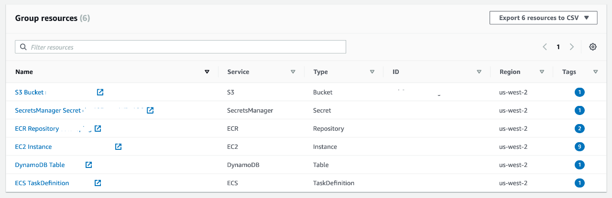

# Tag it up!

## Problem

I get it, tagging stuff without a clear benefit is something few folks are
willing to do. While AWS introduced Resource Groups and the Tag Editor 
[in 2014](https://aws.amazon.com/blogs/aws/resource-groups-and-tagging/), 
oftentimes tags are not first-class citizens.

While there are [good practices](https://www.datadoghq.com/blog/tagging-best-practices/)
for tagging available, it seems that the very act of tagging still is something
lots of folks loath. Maybe the benefits of tagging, for example concerning
[cost control](https://medium.com/@davidevanpaulis/allocate-aws-costs-with-resource-tags-277de240487f) 
or to [simplify access control](https://aws.amazon.com/blogs/security/simplify-granting-access-to-your-aws-resources-by-using-tags-on-aws-iam-users-and-roles/) are not obvious, or maybe it's just too cumbersome?

Let's start with a quick review of the tagging mechanics.

To tag the S3 bucket `example` with `owner=me` you'd use the following command:

```
 aws s3api put-bucket-tagging \
     --bucket example \
     --tagging 'TagSet=[{owner=me}]'
```

To tag the Lambda function `example` with `owner=me` you'd use the following command:

```
aws lambda tag-resource \
    --resource arn:aws:lambda:us-west-1:123456789012:function:example \
    --tags "owner=me"
```

To tag the ELB `example` with `owner=me` you'd use the following command:

```
aws elb add-tags \
    --load-balancer-name example \
    --tags "Key=owner,Value=me"
```

We see a pattern here and that is _consistency_. Or, better say, the lack thereof?
Now, if you've been using AWS consoles you might not be overly surprised to find 
that, but fact is that the inconsistencies are also present in the APIs and by
extension the SDKs. One can argue that this is [Conway](https://en.wikipedia.org/wiki/Conway%27s_law) 
in action, however, there's no need for users to suffer from it.

## Solutions

For example, using a tool like [awsometag](https://tag.aws-cloud.dev/) allows you to tag 
AWS resources in a uniform manner. Let's see it in action (using above examples):

```
awsometag arn:aws:s3:us-west-2::example owner=me

awsometag arn:aws:lambda:us-west-1:123456789102:function:example owner=me

awsometag arn:aws:elasticloadbalancing:eu-west-1:123456789102:loadbalancer/example \
          owner=me
```

Based on tags you can use the [resource group service](https://docs.aws.amazon.com/ARG/latest/userguide/welcome.html)
to deal with all the resources tagged in the previous step:



Further reading:

- [Tagging Best Practices](https://d1.awsstatic.com/whitepapers/aws-tagging-best-practices.pdf)
- [Automatically Enforcing AWS Resource Tagging Policies](https://www.pulumi.com/blog/automatically-enforcing-aws-resource-tagging-policies/)
- [AWS Naming & Tagging Conventions](https://github.com/osodevops/aws-enterprise-namming-tagging-standard)
- [Tagger- AWS tagging tool](https://dev.to/tobhai/tagger-aws-tagging-tool-3db6)

## Conclusion

Tagging doesn't have to be awkward or complicated. And while we likely won't 
be able to change (or: fix?) the APIs top-down we can create and/or use tooling 
such as `awsometag` to make working with said APIs less painful.


